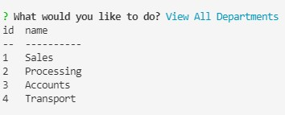
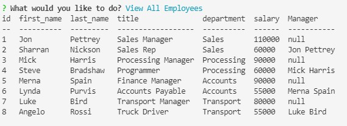
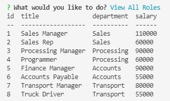
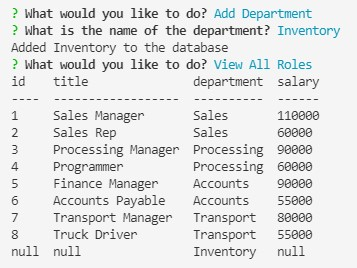
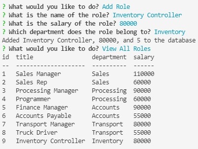
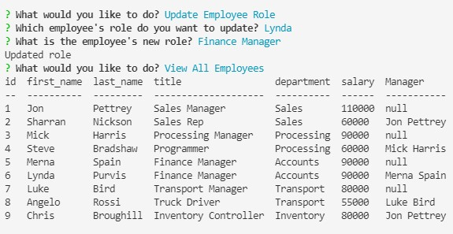

# Employee-Tracker

## The Project

For this Project we had to create an employee tracking app, in the stle of the a CMS (Content Management System). Built from scratch to manage a companies employees database, we used Node,js, inquirer, MYSQL2, and console.table. Because it is not a deployed website you will need to see the video walkthrough link at the bottom of the README file.


## User Story

```md
AS A business owner
I WANT to be able to view and manage the departments, roles, and employees in my company
SO THAT I can organize and plan my business
```

## Acceptance Criteria

```md
GIVEN a command-line application that accepts user input
WHEN I start the application
THEN I am presented with the following options: view all departments, view all roles, view all employees, add a department, add a role, add an employee, and update an employee role
WHEN I choose to view all departments
THEN I am presented with a formatted table showing department names and department ids
WHEN I choose to view all roles
THEN I am presented with the job title, role id, the department that role belongs to, and the salary for that role
WHEN I choose to view all employees
THEN I am presented with a formatted table showing employee data, including employee ids, first names, last names, job titles, departments, salaries, and managers that the employees report to
WHEN I choose to add a department
THEN I am prompted to enter the name of the department and that department is added to the database
WHEN I choose to add a role
THEN I am prompted to enter the name, salary, and department for the role and that role is added to the database
WHEN I choose to add an employee
THEN I am prompted to enter the employee’s first name, last name, role, and manager, and that employee is added to the database
WHEN I choose to update an employee role
THEN I am prompted to select an employee to update and their new role and this information is updated in the database 
```

## Mock-Up

The following video shows an example of the application being used from the command line:

[](https://2u-20.wistia.com/medias/2lnle7xnpk)

## Screenshots

Below are a few screenshots of my departments, employees and roles as per the seeds.sql data





Below are the screenshots of when data has been added and then looking at them 





And finally the screenshot of the updated employee



## A link to a video walk through of the demo

Please see the link to my walkthrough - [Google Drive](https://drive.google.com/file/d/1MTxmmRaCIHB8DmGuweLeVSacGq5O57v6/view)<br>

## Questions
If you have any questions about this projects, please contact me directly at matthewdsena@gmail.com. 
You can view more of my projects at https://github.com/Mattdsena.